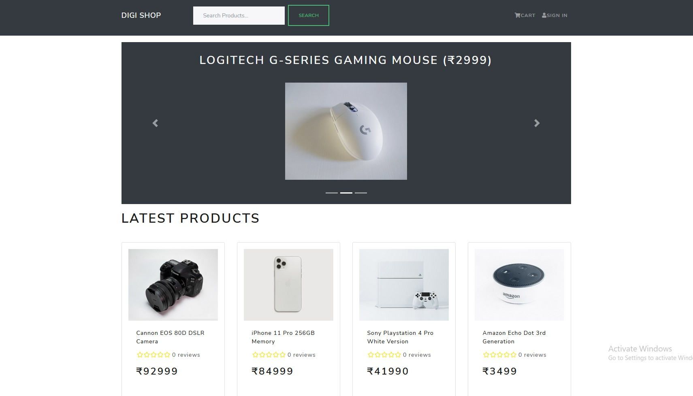

# Digi-Shop
Ecommerce website using MERN and Redux.



## Features

- Full featured shopping cart
- Product reviews and ratings
- Top products carousel
- Product pagination
- Product search feature
- User profile with orders
- Admin product management
- Admin user management
- Admin Order details page
- Mark orders as delivered option
- Checkout process (shipping, payment method, etc)
- Razorpay Integration(Credit/Debit/Netbanking/UPI) / Cash on Delivery Feature
- Database seeder (products & users)
- Firebase media storage

### Run

```
# Run frontend (:3000) & backend (:5000)

#Run frontend
Go to the frontend directory and run
npm start

# Run backend only
Go to the backend directory and run
nodemon server.js
```

### Seed Database

You can use the following commands to seed the database with some sample users and products as well as destroy all data

```
# Import data
npm run data:import

# Destroy data
npm run data:destroy
```
